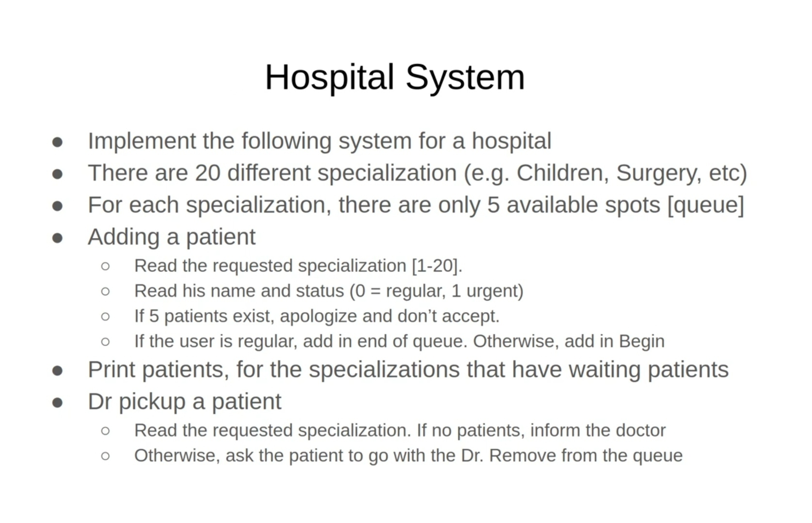

# C++ Consol Project

## **Hospital-System**
Small & Efficient c++ consol __Hospital-System__ with many features.  
 it can provide some useful functions for hospitals and medical centers.  
 >the description of the project

  * you can perform some function by choosing different options as follow:
   1. To Add new patient
   2. Print all patients information
   3. Call the patient by his/her name to see the doctor
   4. Close the program
#### I use some knowledgement in data structure & algorithms **(deque - tuple)** and create many functions to solve sub-problems.
   
    
****